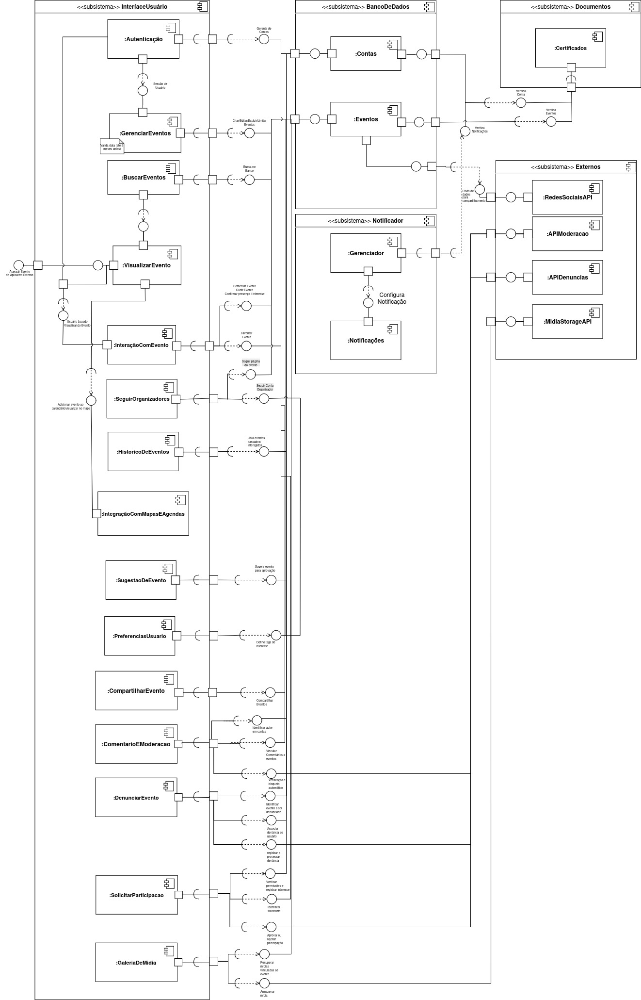

# 4.1.2. Representação Arquitetural

## Introdução

A representação arquitetural visa apresentar como o sistema está organizado em termos de estrutura e componentes. Por meio de diferentes diagramas, é possível visualizar os módulos da aplicação, suas responsabilidades, interações e dependências. Esses artefatos auxiliam no entendimento da arquitetura, facilitando a comunicação entre os membros da equipe e apoiando decisões técnicas durante o ciclo de vida do projeto.

---

## Diagrama de Componentes

Os diagramas de componentes são fundamentais para entender como o sistema é dividido em blocos modulares e autônomos. Eles evidenciam as interfaces e os pontos de integração entre os subsistemas, permitindo uma análise clara das responsabilidades e dependências entre os módulos.

<a id="diagrama1" href="https://app.diagrams.net/#G1wJfimSbmd4osOCK7qIIze7oAvEbS6VWN#%7B%22pageId%22%3A%225f0bae14-7c28-e335-631c-24af17079c00%22%7D" style="display: block; text-align: center;">
  <b>Figura 1</b> – Diagrama de Componentes
</a>

  

Este diagrama representa os principais fluxos do sistema AgendaFCTE, modelando as funcionalidades de acordo com os requisitos funcionais (RFs), como integração com eventos, agendamento, notificações, cadastro de eventos e usuários, entre outros.

### Autores:

- [Víctor Schmidt](https://github.com/moonshinerd)
- [Thales Euflauzino](https://github.com/thaleseuflauzino)
- [Rayene Almeida](https://github.com/rayenealmeida)

---

## Diagrama de Pacotes

O diagrama de pacotes detalha a organização da aplicação em camadas seguindo o padrão arquitetural MVT (Model-View-Template), comum em aplicações Django. Ele é importante para representar a modularidade, separação de responsabilidades e estrutura lógica da aplicação, além de facilitar a manutenção e escalabilidade do sistema.

<strong>Figura 2 - Diagrama de Pacotes</strong>

  

Este diagrama apresenta a divisão entre backend e frontend, separando os pacotes em:  
- **Model** (dados e regras de negócio)  
- **View** (camada de controle e lógica de exibição)  
- **Template** (camada de interface com o usuário)  
- **Configuração** (ajustes de ambiente e integração)  
Além disso, demonstra os relacionamentos e acessos entre esses pacotes.

📹 [Gravação da construção do Diagrama de Pacotes](https://youtu.be/cuPVdnlGUGg)

### Autores:

- [Alexandre Junior](https://github.com/AlexandreLJr)
- [Manoela Garcia](https://github.com/manu-sgc)
- [Maykon Júnio](https://github.com/maykonjuso)
- [Pedro Lopes](https://github.com/pLopess)
- [Victor Bernardes](https://github.com/VHbernardes)

---

## Considerações Finais

Esses diagramas complementares oferecem uma visão abrangente da arquitetura do sistema AgendaFCTE, demonstrando a separação de responsabilidades, os fluxos de dados, dependências e pontos de integração. A aplicação de boas práticas como a organização em camadas, modularidade e uso de padrões arquiteturais contribuem para um sistema escalável, reutilizável e de fácil manutenção.

---

## Referências

> [1] [Diagrama de Componentes](https://unbarqdsw2025-1-turma02.github.io/2025.1-T02-G4_AgendaFCTE_Entrega_02/#/./Modelagem/diagramaComponentes)

> [2] [Diagrama de Pacotes](https://unbarqdsw2025-1-turma02.github.io/2025.1-T02-G4_AgendaFCTE_Entrega_02/#/./Modelagem/diagramaPacotes)

## Histórico de Versões

| Versão | Data       | Descrição                                       | Autor                                   | Revisor | Comentário do Revisor |
|--------|------------|--------------------------------------------------|------------------------------------------|---------|------------------------|
| 1.0    | 23/06/2025 | Criação do Documento Inicial e elaboração do conteúdo | [Rayene Almeida](https://github.com/rayenealmeida) |         |                        |
