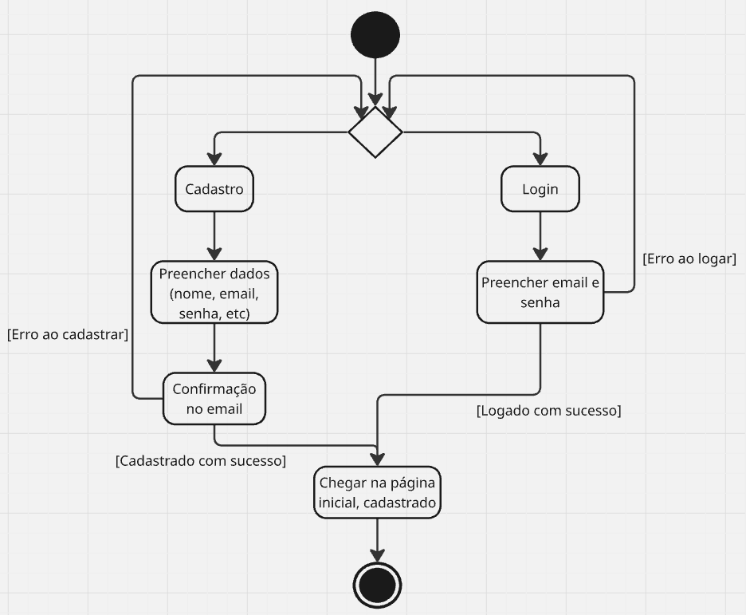
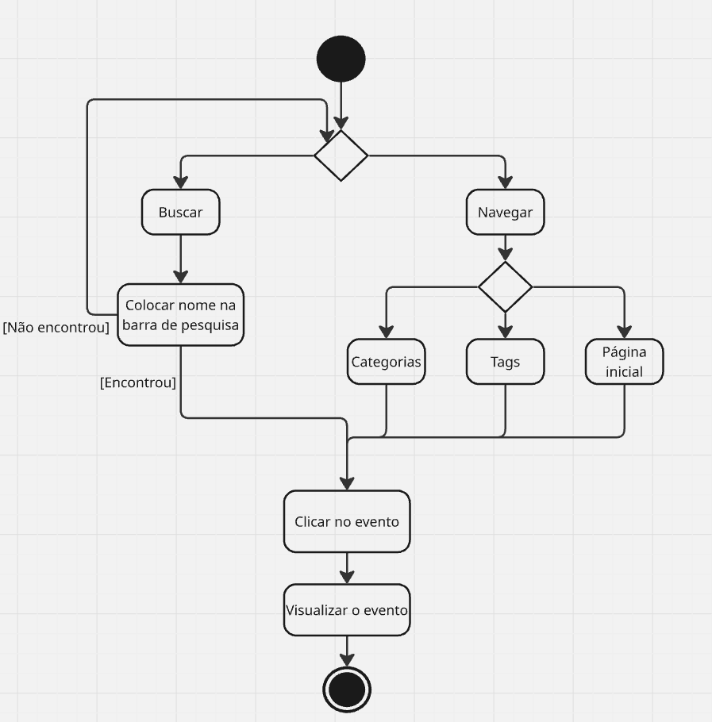
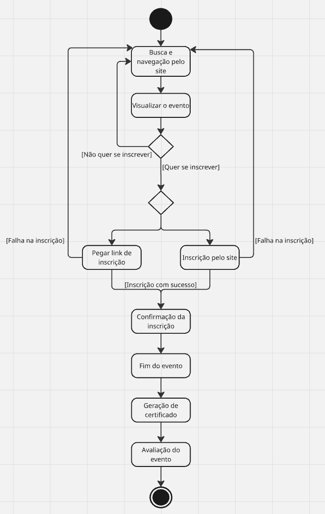
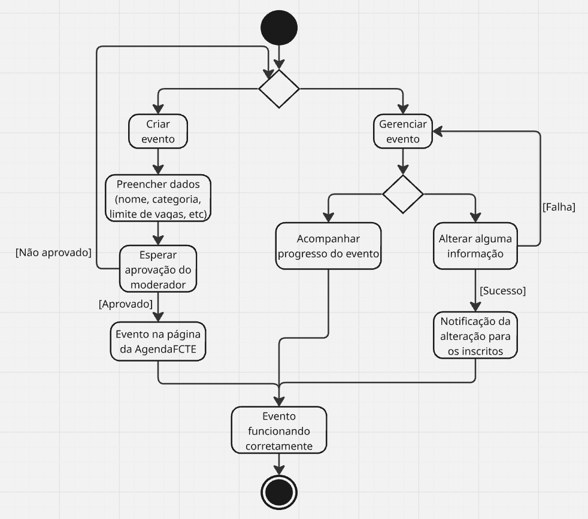
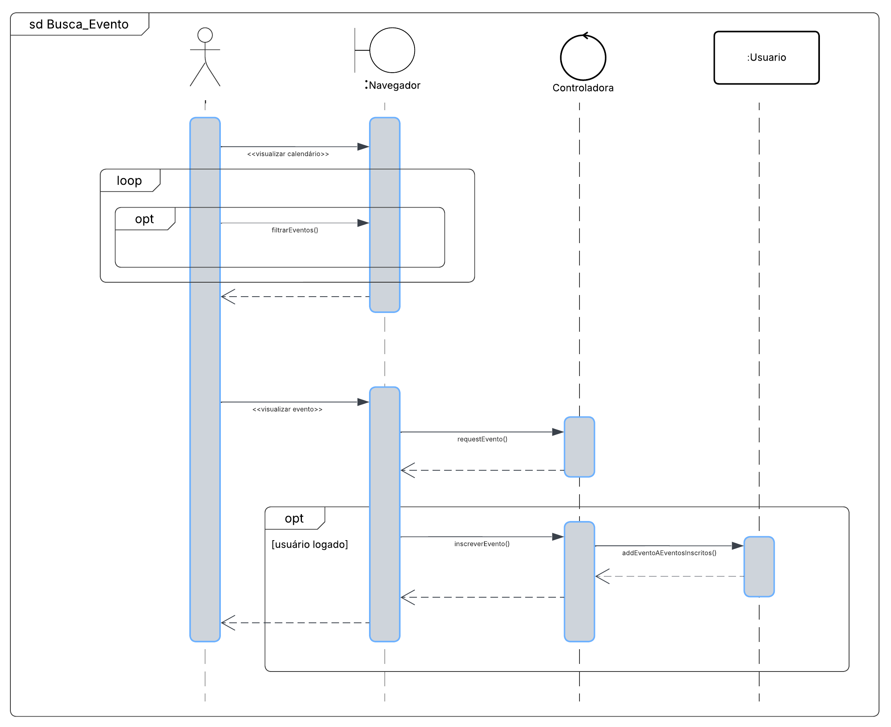
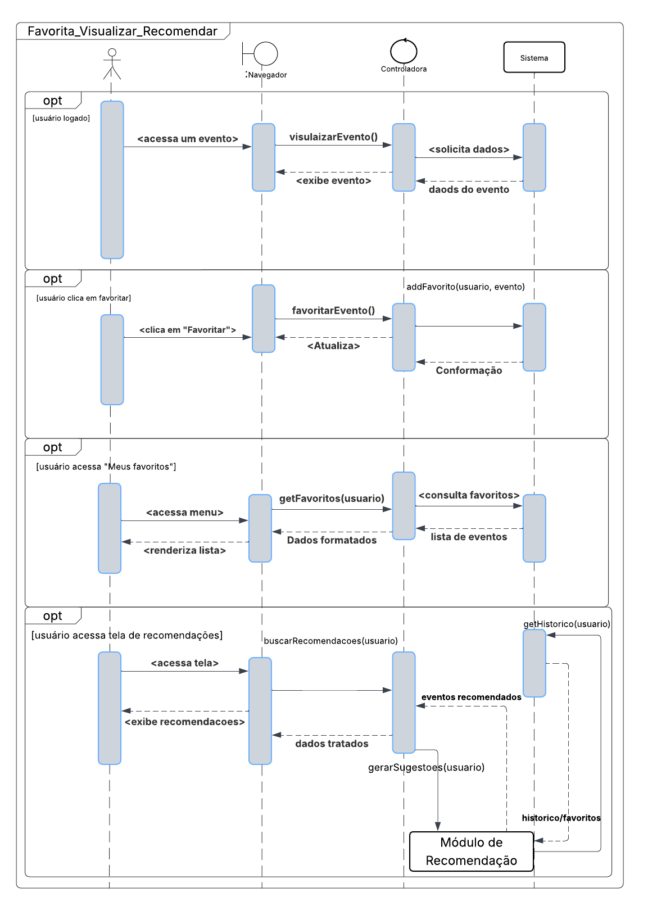
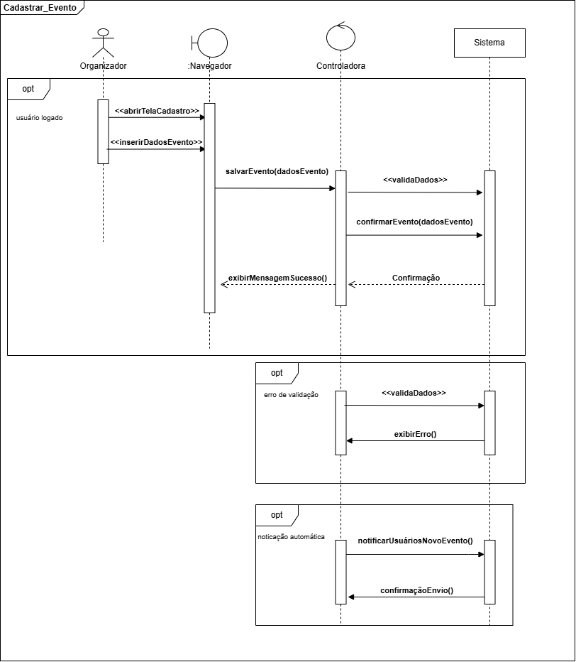

# Visualização de Processo

## Descrição
A visualização de processo é uma representação gráfica ou descritiva dos fluxos de atividades que ocorrem dentro de um sistema ou organização, com o objetivo de demonstrar como tarefas, decisões e interações entre usuários e componentes se encadeiam para atingir determinados resultados. No contexto da engenharia de software, essa visualização facilita o entendimento dos processos de negócio e operacionais que o sistema deve suportar, permitindo identificar claramente os papéis dos usuários, os pontos de decisão, os dados envolvidos e os resultados esperados. Ela serve como uma ferramenta importante de comunicação entre desenvolvedores, analistas e stakeholders durante o projeto e documentação de sistemas.

## Metodologia
Na visualização de processo do projeto AgendaFCTE, serão utilizados diferentes tipos de representações gráficas para descrever e analisar os fluxos de funcionamento do sistema. Essa visualização será feita por meio de diagramas de atividades, proporcionando detalhamento dos processos. Os fluxos foram decididos a partir dos [Requisitos Funcionais](https://unbarqdsw2025-1-turma02.github.io/2025.1-T02-_G4_AgendaFCTE_Entrega_01/#/./Base/1.5.3.PriorizacaoMosCoW?id=prioriza%c3%a7%c3%a3o-dos-requisitos-funcionais) elicitados anteriormente.

## Fluxos do Processo
Para a visualização de processos da AgendaFCTE, serão representados os principais fluxos de uso do sistema, com foco na interação entre usuários e funcionalidades centrais. Os fluxos incluem:

1. **Cadastro e Autenticação de Usuário** - trata da criação de contas, login e controle de acesso
2. **Busca, Navegação e Visualização de Eventos** - detalha a busca de eventos, a navegação por categorias, tags e datas e a exibição do evento
3. **Inscrição e Participação no Evento** - cobre ações como confirmar presença, gerar certificados e avaliar o evento
4. **Criação e Gerenciamento de Evento** - contempla o cadastro, edição e exclusão de eventos pelos organizadores

## Diagramas de Processo
### 1. Cadastro e Autenticação de Usuário
O diagrama de atividades representa o fluxo de Cadastro e Login de Usuário. O usuário inicia escolhendo entre cadastro ou login. No cadastro, ele preenche seus dados e confirma o e-mail para concluir o processo. No login, insere e-mail e senha para autenticar. Em ambos os casos, erros podem redirecionar de volta ao início. Com sucesso, o usuário é direcionado à página inicial do sistema.

**Figura 1 - Diagrama de Atividades - Cadastro e Autenticação de Usuário**

### 2. Busca, Navegação e Visualização de Eventos
O diagrama de atividades mostra o fluxo de Busca, Navegação e Visualização de Eventos, independentemente do login do usuário. Ele pode buscar eventos diretamente pelo nome na barra de pesquisa ou navegar por categorias, tags ou pela página inicial. Ao encontrar um evento de interesse, o usuário clica e visualiza seus detalhes.

**Figura 2 - Diagrama de Atividades - Busca, Navegação e Visualização de Eventos**

### 3. Inscrição e Participação no Evento
O diagrama de atividades mostra o fluxo de Inscrição e Participação no Evento, com o usuário já logado. Após buscar e visualizar um evento, ele decide se quer se inscrever. Caso queira, terá ou a opção de um link externo ou inscrição direta no site. Após a confirmação, o usuário participa do evento, recebe certificado (se disponível) e pode avaliá-lo. Se o usuário não estiver logado, ao tentar se inscrever ele será redirecionado ao fluxo de login/cadastro.

**Figura 3 - Diagrama de Atividades - Inscrição e Participação no Evento**

### 4. Criação e Gerenciamento de Evento
O diagrama de atividades descreve o processo de Criação e Gerenciamento de Evento por um organizador logado. O usuário pode criar um novo evento preenchendo dados e aguardando a aprovação do moderador. Após aprovado, o evento é publicado. O organizador também pode gerenciar eventos existentes, acompanhando o progresso ou alterando informações, que são notificadas aos inscritos. O fluxo termina com o evento em funcionamento.

**Figura 4 - Diagrama de Atividades - Criação e Gerenciamento de Evento**

## Diagrama de Sequência
Apesar de não cobrirem exatamente os mesmos fluxos descritos aqui, na Entrega 2 foram feitos três [Diagramas de Sequência](https://unbarqdsw2025-1-turma02.github.io/2025.1-T02-G4_AgendaFCTE_Entrega_02/#/./Modelagem/diagramaSequencia). Eles representam interações e comportamentos do sistema que permanecem válidos e coerentes com a lógica da aplicação. Por isso, sua reutilização complementa a modelagem atual e contribui para uma visão mais ampla e integrada do sistema.

Colocarei abaixo as imagens desses diagramas para facilitar a visualização, mas eles também estão disponíveis no documento da [Entrega 2](https://unbarqdsw2025-1-turma02.github.io/2025.1-T02-G4_AgendaFCTE_Entrega_02/#/./Modelagem/diagramaSequencia), onde são dados os devidos créditos aos autores e explicações detalhadas.

**Figura 5 - Diagrama de Sequência - Busca e Inscrição em Evento**

**Figura 6 - Diagrama de Sequência - Favoritar, Visualizar Favoritos e Recomendar Eventos**

**Figura 7 - Diagrama de Sequência - Cadastrar Eventos**

## Bibliografia
> AWARI. Visão de processos na arquitetura de software: compreendendo a interação entre componentes. Disponível em: https://awari.com.br/visao-de-processos-na-arquitetura-de-software-compreendendo-a-interacao-entre-componentes/. Acesso em: 26 junho 2025.
>
> CÔRTES, G. O que é visualização de processo na arquitetura de software? [YouTube]. Publicado em: 9 mar. 2023. Disponível em: https://www.youtube.com/watch?v=ZZVEEjeikY8. Acesso em: 26 junho 2025.
>
> UNB. Vídeo-aula – Arquitetura e Desenho de Software: Documento de Arquitetura de Software – Tópico 11c – Visão de Processo. [Stream UnB]. Disponível em: https://unbbr-my.sharepoint.com/personal/mileneserrano_unb_br/_layouts/15/stream.aspx?id=%2Fpersonal%2Fmileneserrano%5Funb%5Fbr%2FDocuments%2FArqDSW%20%2D%20V%C3%ADdeosOriginais%2F11c%20%2D%20Video%2DAula%20%2D%20Arq%20%2D%20DAS%2Emp4. Acesso em: 26 junho 2025.
>
> FAKHROUTDINOV Kirill. Activity Diagrams. uml-diagrams.org. Disponível em: <https://www.uml-diagrams.org/activity-diagrams.html>. Acesso em: 26 junho 2025.

## Histórico de Versão

| Versão | Data | Descrição | Autor | Revisor | Comentário do Revisor |
| -- | -- | -- | -- | -- | -- |
| `1.0`  | 26/06/2025  | Criação do documento e adição da parte teórica | [Manoela Garcia](https://github.com/manu-sgc) | [Víctor Schmidt](https://github.com/moonshinerd) | Texto revisado, tudo parece bem relacionado com os artefatos feitos nas entregas anteriores |
| `1.1`  | 26/06/2025  | Adição dos diagramas de atividade | [Manoela Garcia](https://github.com/manu-sgc) | [Víctor Schmidt](https://github.com/moonshinerd) | Texto revisado, tudo parece bem relacionado com os artefatos feitos nas entregas anteriores |
| `1.2`  | 27/06/2025  | Adição dos diagramas de sequência | [Manoela Garcia](https://github.com/manu-sgc) | [Víctor Schmidt](https://github.com/moonshinerd) | Texto revisado, tudo parece bem relacionado com os artefatos feitos nas entregas anteriores |