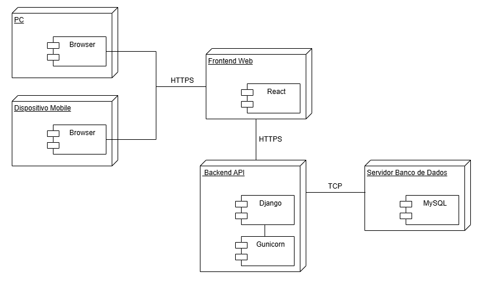

# Visualização do Deploy

Esta seção apresenta a arquitetura de implantação do sistema, detalhando como os diferentes componentes de software são organizados e executados em ambientes de hardware específicos. O objetivo é fornecer uma compreensão clara da infraestrutura tecnológica subjacente que suporta a aplicação, demonstrando a distribuição dos serviços e as interações entre eles ([Bass et al., 2012](#ref1)).

## Descrição

A visualização do deploy descreve a configuração física e lógica do ambiente onde a aplicação será executada. Ela abrange os nós de hardware e os componentes de software que residem neles, bem como os protocolos de comunicação utilizados para garantir a interação fluida entre as partes do sistema. Este detalhamento é crucial para planejamento, monitoramento e manutenção da infraestrutura ([Rozanski & Woods, 2011](#ref2)).

### Diagrama de Implantação

O diagrama de implantação ilustra a arquitetura de software e hardware do sistema, mostrando como os diferentes componentes de software são distribuídos e interagem em nós físicos ([Fowler, 2003](#ref3)). No seu caso, o diagrama representa uma arquitetura comum para aplicações web e mobile, com uma clara separação entre frontend, backend e banco de dados.

**Figura 1 - Diagrama de Implantação**

#### Nós e Componentes:

1.  **PC (Nó):**
    * **Componente:** Browser
    * **Descrição:** Representa um computador pessoal onde o usuário acessa a aplicação web através de um navegador. O navegador é o cliente que interage com o Frontend Web.

2.  **Dispositivo Mobile (Nó):**
    * **Componente:** Browser
    * **Descrição:** Representa um dispositivo móvel (smartphone, tablet) onde o usuário acessa a aplicação web também através de um navegador. Similar ao PC, o navegador no dispositivo móvel atua como cliente para o Frontend Web.

3.  **Frontend Web (Nó):**
    * **Componente:** React
    * **Descrição:** Este nó hospeda a interface do usuário da aplicação, desenvolvida com React. Ele é responsável por renderizar a interface gráfica e interagir com o Backend API para obter e enviar dados.

4.  **Backend API (Nó):**
    * **Componentes:**
        * **Django:** O framework web principal que implementa a lógica de negócios da aplicação e expõe as APIs para o Frontend Web.
        * **Gunicorn:** Um servidor WSGI (Web Server Gateway Interface) que atua como uma ponte entre o servidor web (como Nginx ou Apache, embora não explicitamente mostrado, mas geralmente presente em um ambiente de produção) e o aplicativo Django. Ele gerencia as requisições HTTP e as encaminha para o Django.

5.  **Servidor Banco de Dados (Nó):**
    * **Componente:** MySQL
    * **Descrição:** Este nó é dedicado ao armazenamento e gerenciamento dos dados da aplicação. O MySQL é o sistema de gerenciamento de banco de dados relacional utilizado.

#### Conexões e Protocolos:

* **PC &leftrightarrow; Frontend Web:**
    * **Protocolo:** HTTPS
    * **Descrição:** A comunicação entre o navegador no PC e o Frontend Web é feita via HTTPS, garantindo segurança e criptografia dos dados transmitidos.

* **Dispositivo Mobile &leftrightarrow; Frontend Web:**
    * **Protocolo:** HTTPS
    * **Descrição:** Similar ao PC, a comunicação entre o navegador no dispositivo móvel e o Frontend Web também utiliza HTTPS para garantir a segurança.

* **Frontend Web &leftrightarrow; Backend API:**
    * **Protocolo:** HTTPS
    * **Descrição:** O Frontend Web se comunica com o Backend API para obter dados e enviar informações, utilizando HTTPS para a transmissão segura.

* **Backend API &leftrightarrow; Servidor Banco de Dados:**
    * **Protocolo:** TCP
    * **Descrição:** A comunicação entre o Backend API (Django/Gunicorn) e o Servidor Banco de Dados (MySQL) é realizada via TCP (Transmission Control Protocol). O TCP é um protocolo de transporte fundamental que garante a entrega confiável de dados, essencial para operações de banco de dados.

#### Fluxo de Interação:

1.  O usuário, seja de um PC ou um Dispositivo Mobile, acessa a aplicação através de um navegador.
2.  O navegador faz requisições HTTPs para o **Frontend Web (React)**.
3.  O **Frontend Web** interage com o **Backend API (Django/Gunicorn)** para obter ou enviar dados, também via HTTPS.
4.  O **Backend API (Django/Gunicorn)** processa a requisição e, se necessário, interage com o **Servidor Banco de Dados (MySQL)** via TCP para ler ou gravar informações.
5.  O **Backend API** retorna a resposta para o **Frontend Web**, que por sua vez, atualiza a interface do usuário no navegador do cliente.

## Referências Bibliográficas

> [<a id="ref1">1</a>] Bass, L., Clements, P., & Kazman, R. (2012). Software Architecture in Practice. 3rd ed. Addison-Wesley. (Capítulo 5: Architectural Views, que discute as diferentes visualizações da arquitetura de software, incluindo a de implantação).
>
> [<a id="ref2">2</a>] Rozanski, A., & Woods, E. (2011). Software Systems Architecture: Working With Stakeholders Using Viewpoints and Perspectives. 2nd ed. Addison-Wesley. (Capítulo 12: Deployment Viewpoint, que detalha o propósito e os elementos1 da visualização de implantação).
>
> [<a id="ref3">3</a>] Fowler, M. (2003). UML Distilled: A Brief Guide to the Standard Object Modeling Language. 3rd ed. Addison-Wesley. (Capítulo sobre Diagramas de Implantação, que descreve a finalidade e os elementos desses diagramas no contexto da UML).

| Versão | Data | Descrição | Autor | Revisor | Comentário do Revisor |
| -- | -- | -- | -- | -- | -- |
| `1.0`  | 12/06/2025  | Criação do Documento e Adição do conteúdo junto da elaboração do artefato | [Víctor Schmidt](https://github.com/moonshinerd)  |  |  |