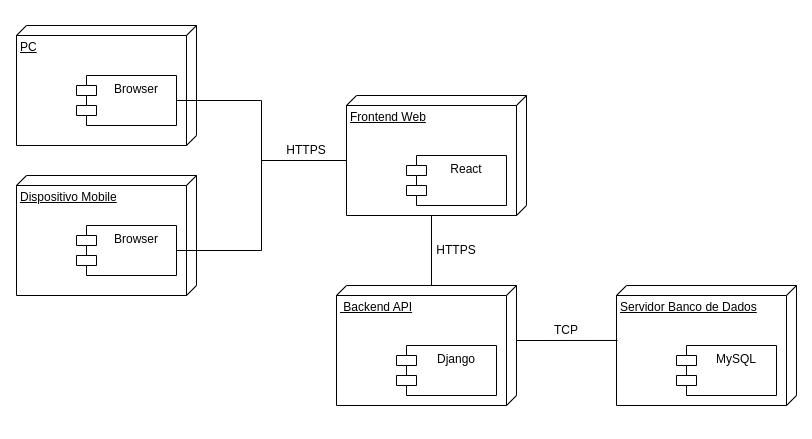

## 4.1.8. Visualização de Implementação

A visualização de implementação do sistema **AgendaFCTE** descreve como os componentes de software foram distribuídos fisicamente em servidores e como se comunicam entre si. O objetivo desta seção é detalhar os aspectos técnicos da infraestrutura e apresentar uma visão clara da arquitetura de implantação, reforçando os princípios de modularidade, segurança e escalabilidade adotados no projeto.

O sistema é estruturado em uma arquitetura multicamadas, composta por frontend, backend e banco de dados, todos conectados através de protocolos seguros. O diagrama abaixo apresenta a disposição e as interações entre os principais elementos que compõem a solução:

<strong>Figura 1 - Diagrama de Implementação do AgendaFCTE</strong>

  

### Autores:

- [Manoela Garcia](https://github.com/manu-sgc)
- [Victor Bernardes](https://github.com/VHbernardes)

### Componentes do Diagrama

#### 1. Cliente (PC e Dispositivo Mobile)
- Usuários acessam o sistema por meio de navegadores.
- A conexão é realizada via HTTPS, garantindo segurança na troca de dados.

#### 2. Frontend Web
- Aplicação desenvolvida em **React.js**, hospedada em servidor específico.
- Interage com o usuário e envia requisições HTTP/HTTPS para o backend.

#### 3. Backend API
- Desenvolvido com **Django**, utilizando **Gunicorn** como servidor WSGI para produção.
- Responsável pela lógica de negócios, autenticação, validação e comunicação com o banco de dados.
- Hospedado no **Render** ou infraestrutura equivalente.

#### 4. Banco de Dados
- Utiliza o **MySQL** como sistema de gerenciamento de banco de dados.
- Comunicação com o backend via TCP, protegida de acessos externos.

Essa separação clara entre as camadas facilita a manutenção, a escalabilidade e a evolução do sistema, permitindo também a substituição ou atualização de partes específicas da arquitetura sem comprometer a aplicação como um todo.

---

## Considerações Finais

A implementação do AgendaFCTE foi pensada para ser clara, segura e fácil de manter. A separação em camadas e o uso de tecnologias conhecidas ajudaram a organizar o desenvolvimento e garantir um bom funcionamento da aplicação.

Com essa estrutura, o sistema está preparado para evoluir com o tempo, recebendo melhorias sem perder a estabilidade. Essa etapa foi essencial para transformar as ideias do projeto em algo funcional e acessível para os usuários.

---

## Bibliografia

> [1] AgendaFCTE - Diagrama de Implementação. Disponível em: [Diagrama de Implementação](https://unbarqdsw2025-1-turma02.github.io/2025.1-T02-G4_AgendaFCTE_Entrega_02/#/./Modelagem/diagramaImplantacao).

## Histórico de Versões

| Versão | Data       | Descrição                                       | Autor                                               | Revisor                                              | Comentário do Revisor              |
|--------|------------|------------------------------------------------|-----------------------------------------------------|------------------------------------------------------|------------------------------------|
| 1.0    | 23/06/2025 | Criação do documento e elaboração do conteúdo | [Rayene Almeida](https://github.com/rayenealmeida) |         |                                     |
