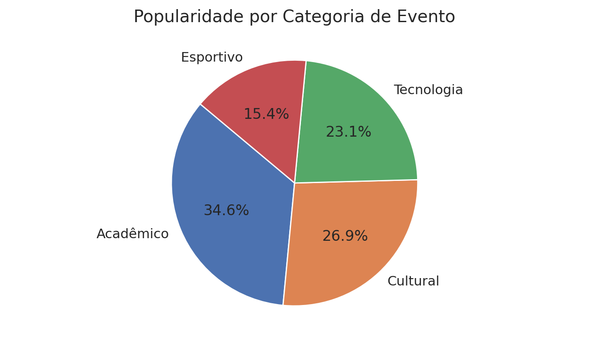
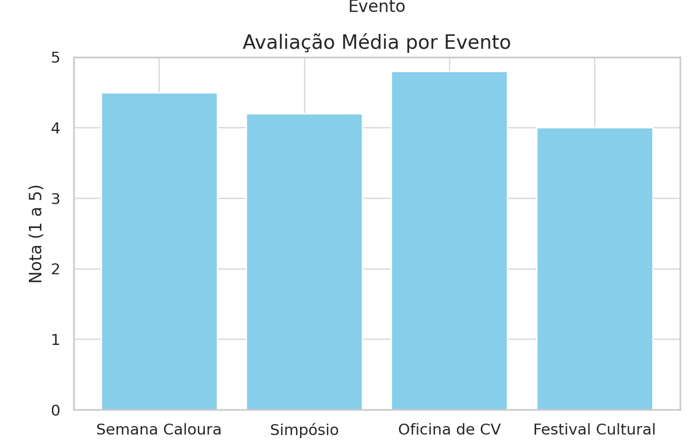
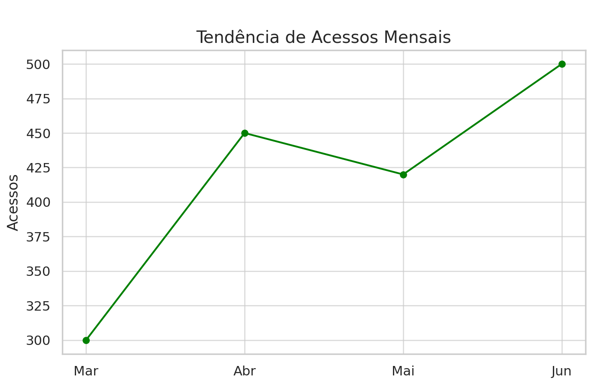

# Visualização de Dados

## Descrição

A visualização de dados refere-se à representação gráfica de informações e dados coletados ou gerados no sistema, permitindo uma análise mais clara, rápida e acessível por parte dos usuários. No contexto do sistema **Agenda FCTE**, essa visualização será essencial para que organizadores, estudantes e demais interessados possam compreender padrões de uso, participação em eventos, níveis de engajamento, avaliações de eventos, entre outros indicadores relevantes. Além disso, auxilia a equipe de desenvolvimento e stakeholders na tomada de decisões fundamentadas com base em evidências visuais.

## Metodologia

Para representar os dados do sistema de forma clara e intuitiva, serão utilizados diferentes tipos de gráficos e dashboards interativos. Estes se apoiarão em bibliotecas e ferramentas como **\*\*\*\*** ou outras integrações com o backend, dependendo da tecnologia utilizada. Os dados apresentados serão provenientes dos registros de uso da plataforma, formulários de avaliação de eventos e interações realizadas pelos usuários.

Os principais objetivos dessa visualização são:

- Auxiliar organizadores a compreender o alcance e impacto de seus eventos.
- Identificar tendências de participação e tópicos de maior interesse.
- Permitir o monitoramento em tempo real ou periódicos de KPIs (indicadores chave de desempenho).

## Exemplos de Visualização

A seguir, são descritas as categorias de dados relevantes no contexto da AgendaFCTE, assim como seus gráficos.

---

### 1. Participação por Evento

**Objetivo**: mostrar o número de inscritos e participantes que atenderam ao evento.

**Aplicação no projeto**: os organizadores poderão comparar o número de inscrições com a taxa de comparecimento real, identificando o real engajamento do evento.

**Tipo sugerido**: gráfico de barras agrupadas (`inscritos` vs `participantes`).

---

### 2. Popularidade de Categorias de Evento

**Objetivo**: identificar quais categorias de evento (como acadêmico, cultural, esportivo, etc) geram mais interesse.

**Aplicação no projeto**: ajuda a FCTE a entender quais áreas têm maior adesão e planejar ações específicas.

**Tipo sugerido**: gráfico de pizza.

---

### 3. Avaliação Média por Evento

**Objetivo**: apresentar a média de avaliações dos eventos com base nos feedbacks dos usuários.

**Aplicação no projeto**: organizadores e coordenadores podem visualizar a qualidade relativa, baseando-se em dados de avaliação dos usuários.

**Tipo sugerido**: gráfico de barras com nota média (1 a 5 estrelas).

---

### 4. Tendência Mensal de Uso da Plataforma

**Objetivo**: acompanhar a quantidade de acessos, interações e inscrições ao longo do tempo.

**Aplicação no projeto**: útil para identificar picos de uso (ex: início de semestre, semanas acadêmicas), servindo para planejamento de infraestrutura.

**Tipo sugerido**: gráfico de linha.

---

## Bibliografia

> EVERGREEN Data. What is Data Visualization? Disponível em: https://stephanieevergreen.com/. Acesso em: 26 junho 2025.  
> TABLEAU. O que é visualização de dados? Disponível em: https://www.tableau.com/pt-br/learn/articles/data-visualization. Acesso em: 26 junho 2025.  
> KIRILL, F. Data Visualization Principles and Practices. [YouTube]. Disponível em: https://www.youtube.com/watch?v=faz4dI0YmYU. Acesso em: 26 junho 2025.

## Histórico de Versão

| Versão | Data       | Descrição                                                   | Autor                                                           | Revisor | Comentário do Revisor |
| ------ | ---------- | ----------------------------------------------------------- | --------------------------------------------------------------- | ------- | --------------------- |
| `1.0`  | 30/06/2025 | Criação da seção e descrição inicial dos gráficos esperados | [Maykon Júnio dos Santos Soares](https://github.com/maykonjuso) | —       | -                     |
| `1.1`  | 30/06/2025 | Adição de categorias de dados e gráficos. | [João Lucas](https://github.com/joaolucas102) | —       | -                     |
