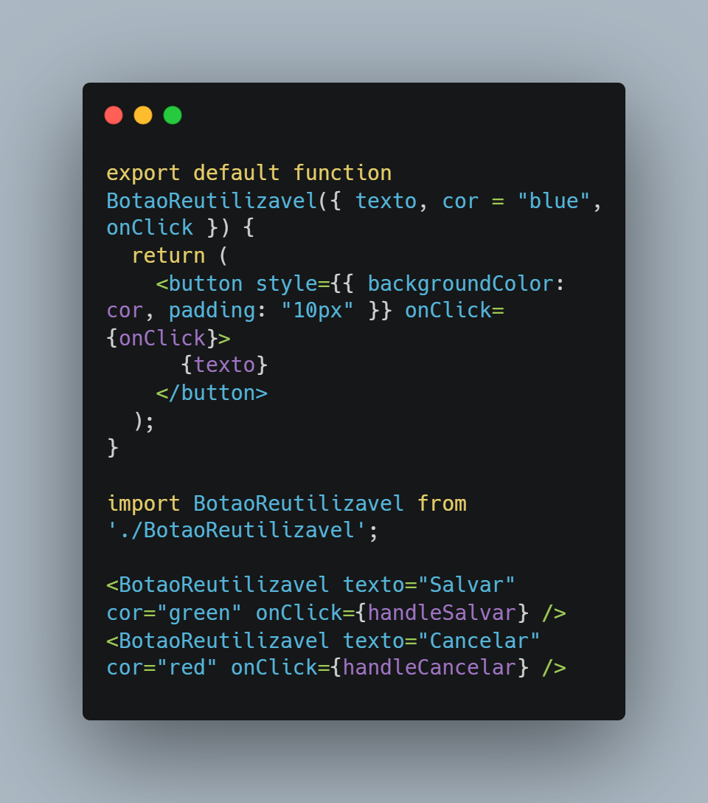
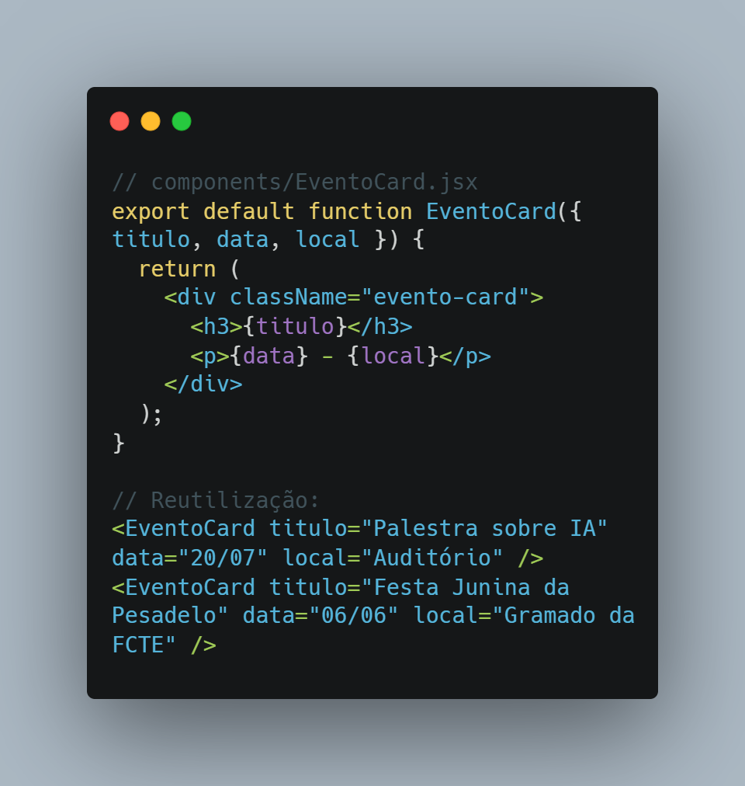
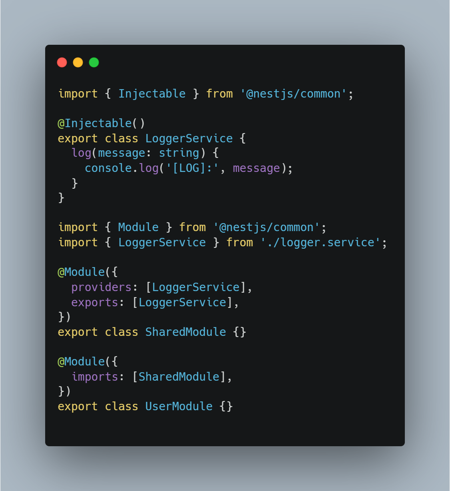
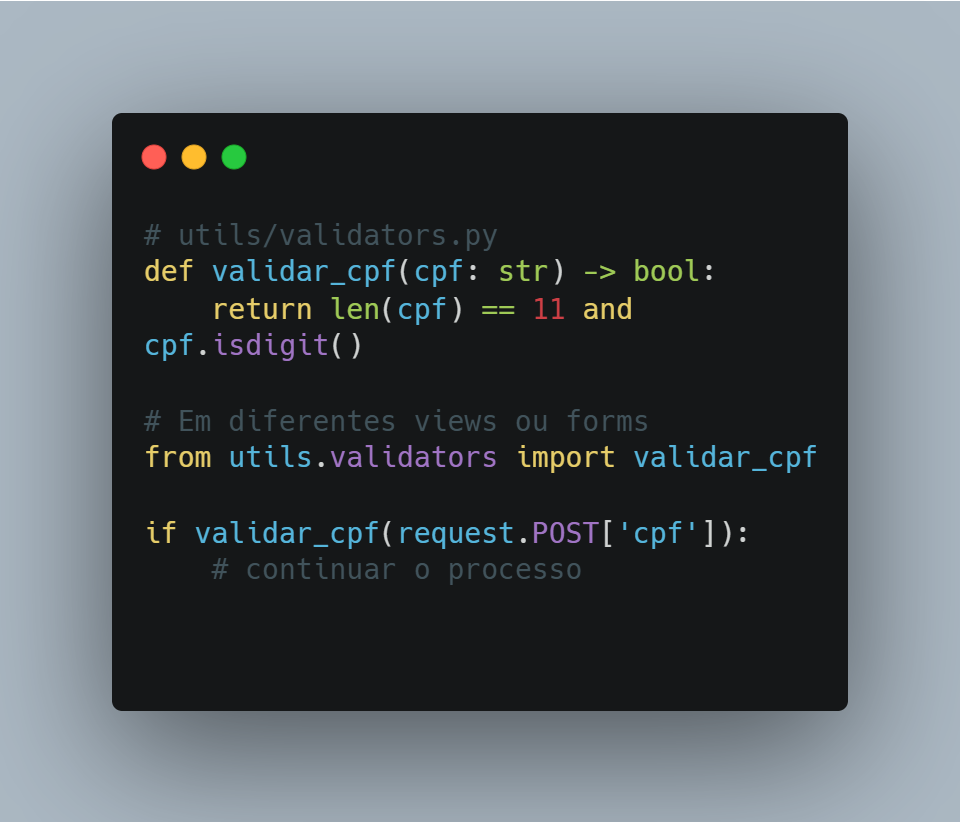
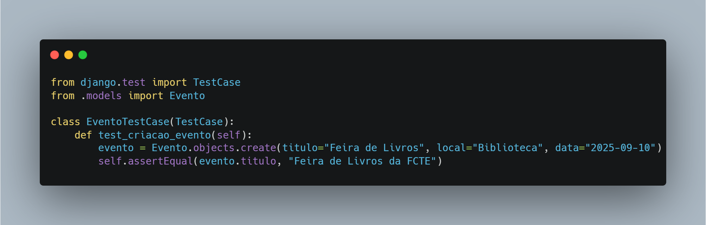

# 4.2. Módulo Reutilização de Software

## Introdução 

É o processo de utilizar novamente artefatos já desenvolvidos, como código, componentes, APIs, requisitos e testes, em novos sistemas ou funcionalidades, reduzindo esforço e aumentando a eficiência. No contexto da Agenda Cultural FCTE, a reutilização permite economizar tempo e evitar erros já conhecidos. 

## Benefícios 

- Acelera o desenvolvimento
- Melhora a qualidade
- Diminui custos e retrabalho
- Facilita a manutenção
- Promove consistência entre sistemas

## Formas de Reutilização de Software 

- Requisitos e documentação
- Código fonte
- Componentes e bibliotecas
- Serviços (APIs, microsserviços)
- Testes automatizados

Abaixo colocarei exemplos práticos de reutilização de software para o nosso projeto.

## Requisitos

Abaixo estão alguns exemplos de **requisitos funcionais reutilizáveis** que podem ser adaptados para outros projetos com foco em gerenciamento de eventos, como sistemas acadêmicos, feiras e festivais.

| **Requisito**                  | **Descrição**                                                                 |
|-------------------------------|-------------------------------------------------------------------------------|
| Cadastro de usuários           | Permitir login com e-mail e autenticação via redes sociais (OAuth).          |
| Sistema de eventos             | Criar, editar, excluir e listar eventos com data, hora, local e descrição.   |
| Filtro de busca                | Buscar eventos por nome, categoria, data ou localização.                     |
| Confirmação de presença (RSVP) | Permitir que o usuário confirme ou recuse presença em eventos.               |
| Notificações                   | Enviar lembretes e alertas via e-mail ou notificações push.                 |
| Categorias de eventos          | Classificar eventos em categorias como música, teatro, palestras, etc.       |
| Agenda pessoal                 | Adicionar eventos a uma agenda personalizada do usuário.                     |
| Integração com mapas           | Exibir localização dos eventos com base no endereço ou coordenadas geográficas. |
| Comentários e avaliações       | Usuários podem comentar e avaliar eventos após participação.                 |

## Código fonte 

### React
No React, componentes são funções reutilizáveis que retornam trechos de interface. Criar um componente como BotaoReutilizavel permite reaproveitá-lo em diferentes lugares da aplicação, mudando apenas as props como texto, cor ou ação. Essa prática evita duplicação de código e facilita a manutenção visual do sistema.

  
  
Código reutilizavel utilizando React

Componentes visuais como EventoCard encapsulam a apresentação de um evento em um único bloco reutilizável. Isso permite que a mesma estrutura visual (com título, data e local) seja reaproveitada em diversas telas, mudando apenas os dados. Além de reduzir retrabalho, isso garante consistência visual.

  
  
Código reutilizavel utilizando React

### NestJS

Em NestJS, serviços como LoggerService podem ser registrados em um módulo compartilhado (SharedModule) e utilizados em diferentes partes do sistema com injeção de dependência. Isso promove modularidade e reutilização de lógica comum, como logs, autenticação ou validação.

  
  
Código reutilizavel utilizando Nest JS

### Django 

O validar_cpf() é uma função Python escrita uma vez e importada sempre que necessário. É um clássico exemplo de reutilização de lógica por código.

  
  
Código reutilizavel utilizando Django

## Testes automatizados reutilizavéis

Ao usar estruturas como test.each() no Jest, é possível validar a mesma função com múltiplos dados, reaproveitando o teste para diferentes entradas. Por exemplo, uma função validarEmail() pode ser testada com diversos formatos de e-mail em um único teste reutilizável e escalável.

  

## Cuidados necessários para reutilização de Software 

- Adaptar requisitos ao novo contexto
- Verificar compatibilidade técnica
- Manter documentação atualizada
- Evitar dependências desnecessárias

## Bibliografia

> DEVMEDIA. Reutilização de Software - Revista Engenharia de Software Magazine 39 Disponível em: https://www.devmedia.com.br/reutilizacao-de-software-revista-engenharia-de-software-magazine-39/21956. Acesso em: 27 junho 2025.
>
> Gamma, E., Helm, R., Johnson, R., & Vlissides, J. (1994). Design Patterns: Elements of Reusable Object-Oriented Software. Addison-Wesley.
>

# Histórico de Versões

| Versão | Data | Descrição | Autor | Revisor | Comentário do Revisor |
| -- | -- | -- | -- | -- | -- |
| `1.0`  | 27/06/2025  | Criação do Documento Inicial e elaboração do conteúdo| [Pedro Lopes](https://github.com/pLopess) e [Alexandre Júnior](https://github.com/AlexandreLJr) | [Víctor Schmidt](https://github.com/moonshinerd) | Texto está correto, artefato tem boa qualidade e relaciona o que é esperado nessa entrega |

