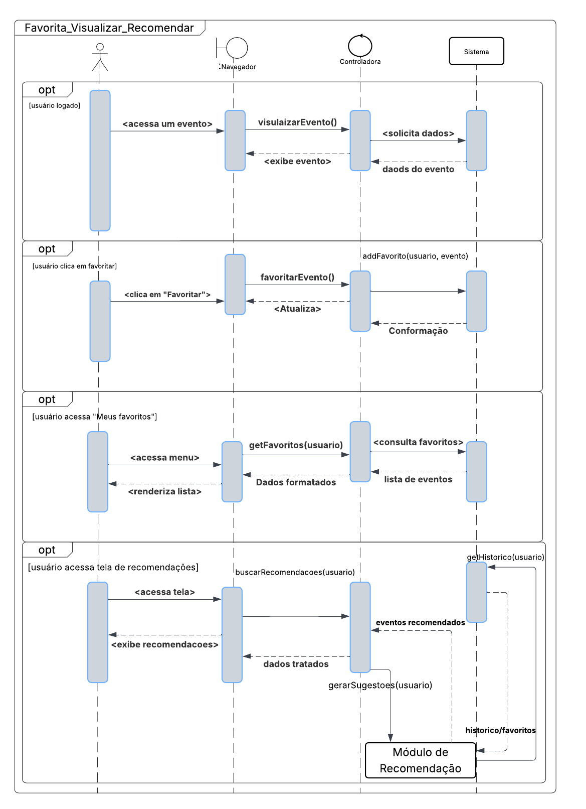

## 4.1.5. Visualização Lógica

A visualização lógica representa a estrutura do sistema em termos de componentes, classes e suas interações, geralmente por meio de diagramas de classes e componentes. Ela fornece uma visão clara da organização do código e da lógica de negócio, sendo essencial para o desenvolvimento, pois orienta como os elementos do sistema serão implementados e integrados.

### Objetivo

A construção da visão lógica na arquitetura de software começa com a análise dos requisitos funcionais do sistema. A partir disso, o sistema é decomposto em módulos independentes, modelados por meio de classes e objetos. Diagramas de classes representam essas estruturas e seus relacionamentos, enquanto pacotes organizam o código de forma modular. Interfaces definem os pontos de comunicação entre os módulos, promovendo a separação de responsabilidades. A documentação detalhada e a revisão contínua asseguram a qualidade do projeto e o alinhamento com seus objetivos.

### Diagrama de Classes 

  Diagrama de Classes - AgendaFCTE

<iframe frameborder="0" style="width:100%;height:813px;" src="https://viewer.diagrams.net/?tags=%7B%7D&lightbox=1&highlight=0000ff&edit=_blank&layers=1&nav=1&title=Diagrama%20sem%20nome.drawio&dark=0#Uhttps%3A%2F%2Fdrive.google.com%2Fuc%3Fid%3D1a8vjl-f4PtqR1LjD4guzCn48yVgNlpyo%26export%3Ddownload"></iframe>

<b>Autores:</b> [Alexandre Junior](https://github.com/AlexandreLJR), [Pedro Lopes](https://github.com/PLopess), 2025.

O Diagrama de Classes representa a estrutura lógica do sistema, detalhando as classes, seus atributos, métodos e os relacionamentos entre elas. É fundamental para compreender a organização interna do código e a lógica de negócio, servindo como base para o desenvolvimento e manutenção do sistema.

### Diagrama de Estados

  Diagrama de Estados - AgendaFCTE

<iframe frameborder="0" style="width:100%;height:749px;" src="https://viewer.diagrams.net/?tags=%7B%7D&lightbox=1&highlight=0000ff&edit=https%3A%2F%2Fapp.diagrams.net%2F%23G1dj738qSWtRH6K0qWtVimGE9OIRKDBL8L%23%257B%2522pageId%2522%253A%252258cdce13-f638-feb5-8d6f-7d28b1aa9fa0%2522%257D&layers=1&nav=1&title=diagrama-estados.drawio&dark=0#Uhttps%3A%2F%2Fdrive.google.com%2Fuc%3Fid%3D1dj738qSWtRH6K0qWtVimGE9OIRKDBL8L%26export%3Ddownload"></iframe>

<b>Autores:</b> [Victor Schmidt](https://github.com/moonshinerd), [Thales Euflauzino](https://github.com/thaleseuflauzino), 2025.

O Diagrama de Estados é uma ferramenta essencial na modelagem dos aspectos dinâmicos de um sistema. Ele representa os diferentes estados que um objeto pode assumir ao longo de seu ciclo de vida, assim como os eventos que provocam mudanças entre esses estados. Esse tipo de diagrama é especialmente útil para entender o comportamento de objetos que possuem respostas específicas a determinados estímulos ou condições ao longo do tempo.

### Diagramas de Sequência

  Diagrama de Sequência - Busca e Inscrição em Evento  <gitbr>

  Diagrama de Sequência - Favoritar, Visualizar Favoritos e Recomendar Eventos  <gitbr>

  Diagrama de Sequência - Cadastro de Evento  <gitbr>

<b>Autor:</b> [Victório Lázaro](https://github.com/Victor-oss), [Rayene Almeida](https://github.com/rayenealmeida) e [Pedro Lopes](https://github.com/PLopess), 2025

O Diagrama de Sequência, utilizado na UML (Unified Modeling Language), representa a interação entre objetos ao longo do tempo, destacando a troca de mensagens em um determinado cenário. Ele é especialmente útil para visualizar o fluxo de execução de funcionalidades, mostrando a ordem e o tempo das chamadas entre métodos e objetos. Esse diagrama facilita o entendimento do comportamento dinâmico do sistema, principalmente em projetos com múltiplas classes e interações complexas.

### Diagrama de Componentes

  Diagrama de Componentes - AgendaFCTE

<iframe frameborder="0" style="width:100%;height:493px;" src="https://viewer.diagrams.net/?tags=%7B%7D&lightbox=1&highlight=000000&edit=https%3A%2F%2Fapp.diagrams.net%2F%23G1wJfimSbmd4osOCK7qIIze7oAvEbS6VWN%23%257B%2522pageId%2522%253A%25225f0bae14-7c28-e335-631c-24af17079c00%2522%257D&layers=1&nav=1&title=diagrama-componenete.drawio&dark=0#Uhttps%3A%2F%2Fdrive.google.com%2Fuc%3Fid%3D1wJfimSbmd4osOCK7qIIze7oAvEbS6VWN%26export%3Ddownload"></iframe>

<b>Autor:</b> [Thales Euflauzino](https://github.com/thaleseuflauzino), [Rayene Almeida](https://github.com/rayenealmeida) e [Víctor Schmidt](https://github.com/moonshinerd), 2025

O Diagrama de Componentes é uma ferramenta essencial na modelagem da arquitetura lógica de alto nível de um sistema. Ele é utilizado para representar os módulos principais do sistema — chamados componentes — e como eles se relacionam entre si por meio de interfaces e dependências. Esses diagramas são úteis para visualizar a organização estrutural do código-fonte, bibliotecas externas, APIs e serviços, facilitando o entendimento de como os módulos se integram para formar o sistema como um todo.

### Diagrama de Pacotes

  Diagrama de Pacotes - AgendaFCTE

<b>Autor:</b> <a href="https://github.com/AlexandreLJr">Alexandre Junior, </a><a href="https://github.com/manu-sgc">Manoela Garcia, </a><a href="https://github.com/maykonjuso">Maykon Júnio, </a><a href="https://github.com/pLopess">Pedro Lopes, </a><a href="https://github.com/VHbernardes">Victor Bernardes</a>, 2025

O Diagrama de Pacotes é utilizado para organizar e agrupar elementos do sistema, como classes e interfaces, em unidades lógicas chamadas pacotes. Ele oferece uma visão clara da estrutura modular do sistema, destacando a separação de responsabilidades, os relacionamentos entre os módulos e a arquitetura geral. Essa modelagem é fundamental para promover a manutenibilidade, reutilização de código e compreensão do projeto, especialmente em sistemas com grande número de classes.

## Referências

> AgendaFCTE - Diagrama de Classes. Disponível em: [Diagrama de Classes](https://unbarqdsw2025-1-turma02.github.io/2025.1-T02-G4_AgendaFCTE_Entrega_02/#/./Modelagem/diagramaClasses).  
>
> AgendaFCTE - Diagrama de Estados. Disponível em: [Diagrama de Estados](https://unbarqdsw2025-1-turma02.github.io/2025.1-T02-G4_AgendaFCTE_Entrega_02/#/./Modelagem/diagramaEstados).  
>
> AgendaFCTE - Diagrama de Sequência . Disponível em: [Diagrama de Sequência](https://unbarqdsw2025-1-turma02.github.io/2025.1-T02-G4_AgendaFCTE_Entrega_02/#/./Modelagem/diagramaSequencia).  
>
> AgendaFCTE - Diagrama de Pacotes . Disponível em: [Diagrama de Pacotes](https://unbarqdsw2025-1-turma02.github.io/2025.1-T02-G4_AgendaFCTE_Entrega_02/#/./Modelagem/diagramaPacotes).  
>
> AgendaFCTE - Diagrama de Componentes . Disponível em: [Diagrama de Componentes](https://unbarqdsw2025-1-turma02.github.io/2025.1-T02-G4_AgendaFCTE_Entrega_02/#/./Modelagem/diagramaComponentes).  

## Histórico de versões

| Versão | Data | Descrição | Autor | Revisor | Comentário do Revisor |
| -- | -- | -- | -- | -- | -- |
| `1.0`  | 11/06/2025  | Criação do Documento Inicial | [Thales Euflauzino](https://github.com/thaleseuflauzino) | [Rayene Almeida ](https://github.com/rayenealmeida) |  19/06/2025 |
| `1.1`  | 11/06/2025  | Adicionando os artefatos lógicos produzidos na etapa 2 | [Thales Euflauzino](https://github.com/thaleseuflauzino) | [Rayene Almeida ](https://github.com/rayenealmeida)  | 19/06/2025 |